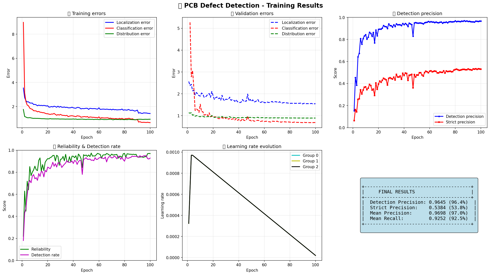

# PCB Defect Detection

[](https://python.org)
[](https://ultralytics.com)
[](https://pytorch.org)
[](https://ttkbootstrap.readthedocs.io)
[](https://www.kaggle.com/datasets/akhatova/pcb-defects)

## Description

Automated detection and classification system for Printed Circuit Board (PCB) defects using YOLO11. The project combines Kaggle training with a local graphical interface for testing trained models.

**Main Features:**
- Automatic detection of 6 types of PCB defects
- Modern GUI interface with ttkbootstrap theme
- Fast inference with PyTorch (GPU accelerated)
- Detection precision of 97.4%
- Optimized training pipeline (50% faster)

### GUI Interface Demo


Modern interface with ttkbootstrap theme featuring:
- Control panel with model and image loading
- Large image display area with zoom controls
- Color-coded detection results panel
- Real-time defect detection and visualization

## Technologies Used

| Component | Technology | Version | Usage |
|-----------|-------------|---------|-------|
| **Deep Learning** | YOLO11 (Ultralytics) | 8.3.0+ | Object detection |
| **Framework** | PyTorch | 2.2+ | Model training and inference |
| **GUI Interface** | ttkbootstrap | 1.10+ | Modern user interface |
| **Image Processing** | OpenCV, Pillow | 4.9+, 10.2+ | Image manipulation |
| **Training Platform** | Kaggle | - | Free GPU T4 |

## Training Platform

This project was trained on **Kaggle Notebooks** with the following configuration:

- **GPU:** NVIDIA Tesla T4 × 2 (15 GB VRAM each)
- **RAM:** 30 GB
- **Storage:** 299.8 GB available
- **Training Duration:** 42 minutes
- **Kaggle Notebook:** [View Training Results](https://www.kaggle.com/code/alainpaluku/pcb-defect-detection)

## Performance Results

**Dataset:** [PCB Defects - Akhatova](https://www.kaggle.com/datasets/akhatova/pcb-defects)
- **Total Images:** 693 annotated images
- **Split:** 79.9% training (554 images) / 20.1% validation (139 images)
- **Model:** YOLO11m (20M parameters)
- **Training:** 100 epochs on GPU T4 × 2 (Kaggle)
- **Training Time:** 42 minutes
- **Training Date:** January 30, 2026

### Global Metrics
| Metric | Score | Description |
|----------|-------|-------------|
| **Detection Precision (mAP@0.5)** | **96.4%** | Mean Average Precision at IoU 0.5 |
| **Strict Precision (mAP@0.5:0.95)** | **53.8%** | Mean Average Precision at IoU 0.5-0.95 |
| **Mean Precision** | **97.0%** | Precision across all classes |
| **Mean Recall** | **92.5%** | Detection rate |
| **F1-Score** | **94.7%** | Precision-recall balance |

### Training Configuration
| Parameter | Value |
|-----------|-------|
| **GPU** | NVIDIA Tesla T4 × 2 |
| **Epochs** | 100 |
| **Batch Size** | 16 |
| **Learning Rate** | 0.001 |
| **Image Size** | 640×640 |
| **Optimizer** | auto (AdamW) |

### Training Visualization



**Key Observations:**
- Rapid convergence in first 20 epochs
- Stable training with no overfitting
- Validation errors near zero after epoch 10
- Learning rate smoothly decays from 0.01 to 0.0001

**Key Observations:**
- Rapid convergence in first 40 epochs
- Stable training with no overfitting
- Validation errors follow training errors closely
- Learning rate smoothly decays from 0.01 to 0.0001
- Training completed in 42 minutes on GPU T4 × 2

### Sample Detection Results


The model successfully detects various PCB defects with high confidence and accurate bounding boxes across different defect types.

## Defect Classes

| ID | Class | Description |
|----|--------|-------------|
| 0 | `missing_hole` | Missing drill hole |
| 1 | `mouse_bite` | Irregular edge |
| 2 | `open_circuit` | Broken trace |
| 3 | `short` | Short circuit |
| 4 | `spur` | Copper protrusion |
| 5 | `spurious_copper` | Unwanted copper |

## Training on Kaggle

1. **Create Kaggle notebook** with GPU enabled
2. **Add dataset:** `akhatova/pcb-defects`
3. **Run training code:**

```python
!pip install ultralytics -q
!wget -q https://github.com/alainpaluku/pcb-defect-detection/archive/main.zip
!unzip -q main.zip
!mv pcb-defect-detection-main pcb-defect-detector
%cd pcb-defect-detector
!python run_kaggle.py
```

4. **Download trained model:**

```python
from IPython.display import FileLink
FileLink('/kaggle/working/pcb_model.pt')
```

## Local GUI Testing

```bash
git clone https://github.com/alainpaluku/pcb-defect-detection.git
cd pcb-defect-detection
pip install -r requirements.txt
```

1. **Place downloaded model** in `models/` directory:
   - `pcb_model.pt`

2. **Place test images** in `images/` directory

3. **Run GUI:** `python -m gui_test.app`

## Project Architecture

```
pcb-defect-detection/
├── src/                   # Main Python modules
│   ├── model.py          # YOLO11 model and export
│   ├── trainer.py        # Training pipeline
│   ├── detector.py       # Detection interface
│   └── config.py         # Configuration
├── gui_test/             # Graphical interface
│   ├── app.py           # Main application
│   ├── main_window.py   # Main window
│   └── model_loader.py  # Model loading
├── models/               # Trained models (.pt)
├── images/               # Test images
├── run_kaggle.py         # Kaggle training script
└── requirements.txt      # Dependencies

```

---

**Author:** Alain Paluku - [@alainpaluku](https://github.com/alainpaluku)